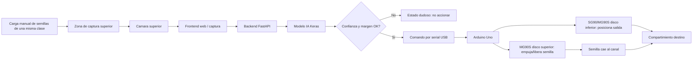
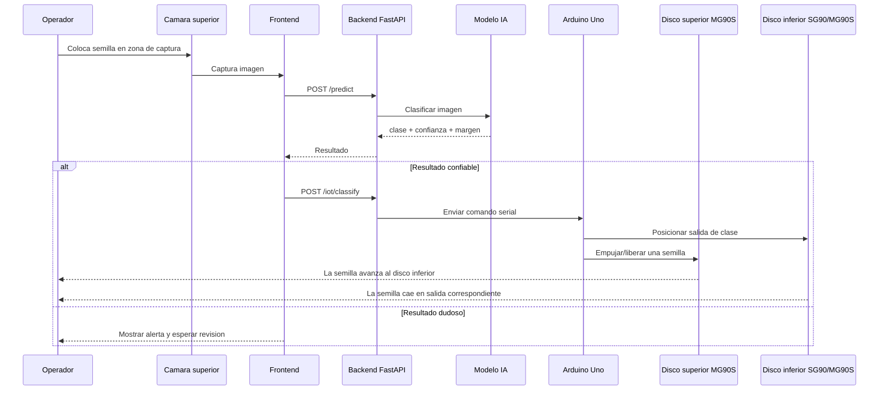

# Planos de arquitectura IoT del clasificador de semillas

Documento tecnico para explicar el prototipo fisico, su arquitectura IoT y una propuesta de mejora con medidas aproximadas. Las medidas se estiman a partir de las fotos y estan pensadas para que las piezas encajen en un prototipo funcional de mesa.

## Alcance del prototipo

El sistema clasifica semillas por vision artificial y acciona un mecanismo con Arduino y servos. El mecanismo trabaja semilla por semilla. La carga puede hacerse manualmente por cantidades de una misma clase; no se recomienda mezclar clases en el deposito de entrada.

Clases activas:

- `arbejas`
- `arroz`
- `frijol`
- `maiz_pira`

## Lectura mecanica del prototipo

Con las fotos recibidas se identifica esta estructura:

- Base rectangular de carton/carton paja sobre una mesa.
- Dos discos o modulos circulares apilados verticalmente.
- Un disco superior que actua como empujador o dosificador de la semilla.
- Un disco inferior o segundo disco que actua como selector/carrusel de salida.
- Servo MG90S montado por debajo del disco superior, con el eje atravesando la base.
- Servo SG90 o MG90S montado por debajo del disco inferior, con el eje atravesando la base.
- Varillas de madera como columnas de soporte.
- Arduino Uno y protoboard conectados por USB al computador.
- Camara prevista en vista superior.

## Arquitectura IoT general



## Secuencia de operacion



## Plano por niveles

```text
Vista lateral aproximada

              Camara superior
                    |
                    v
        +------------------------+
        | Modulo superior        |  <- disco empujador / dosificador
        | MG90S montado debajo  |
        +-----------+------------+
                    |
                    | caida controlada
                    v
        +------------------------+
        | Modulo inferior        |  <- disco selector de salida
        | SG90/MG90S debajo     |
        +-----------+------------+
                    |
                    v
        +------------------------+
        | Base / recipientes     |
        +------------------------+

Electronica lateral:
PC/Backend -> USB -> Arduino -> senales PWM -> MG90S superior + SG90/MG90S inferior
```

## Vista superior del mecanismo

```text
                         CAMARA SUPERIOR
                              |
                              v
            +-------------------------------------+
            |          MODULO SUPERIOR            |
            |                                     |
            |     Disco empujador / paleta        |
            |     libera una semilla por ciclo    |
            +------------------+------------------+
                               |
                               v
            +-------------------------------------+
            |          MODULO INFERIOR            |
            |                                     |
            |        [arbejas]     [arroz]        |
            |                                     |
            |        [frijol]      [maiz_pira]    |
            |                                     |
            +-------------------------------------+
```

## Medidas aproximadas recomendadas

Estas medidas son propuestas para rehacer el prototipo con mejor encaje. Pueden ajustarse segun el material disponible.

### Base general

| Pieza | Medida recomendada |
|---|---:|
| Base rectangular | 320 mm x 220 mm |
| Material base | MDF 3 mm, carton piedra rigido o acrilico 3 mm |
| Altura total entre base y disco superior | 130 mm a 160 mm |
| Separacion entre disco superior e inferior | 55 mm a 75 mm |
| Columnas/soportes | 4 varillas de 8 mm a 10 mm de diametro |
| Base cuadrada del disco superior | 220 mm x 220 mm |

### Disco superior: dosificador / empujador

| Pieza | Medida recomendada |
|---|---:|
| Base cuadrada del modulo | 220 mm x 220 mm |
| Diametro exterior | 185 mm aprox. |
| Altura de pared circular | 35 mm a 45 mm |
| Grosor de material | 2 mm a 3 mm |
| Abertura de salida | 28 mm x 22 mm |
| Paleta empujadora | 120 mm largo x 25 mm alto |
| Eje central del servo | MG90S centrado en el disco |
| Separacion paleta-piso | 2 mm a 4 mm |

Objetivo: que la paleta arrastre una semilla sin atascarse y la lleve hacia la abertura. Para frijol y maiz pira, la abertura debe ser un poco mas amplia que para arroz.

### Disco inferior: selector de clase

| Pieza | Medida recomendada |
|---|---:|
| Diametro exterior | 180 mm |
| Altura de pared circular | 40 mm a 50 mm |
| Numero de compartimientos | 4 |
| Angulo por compartimiento | 90 grados |
| Abertura de entrada | 30 mm x 25 mm |
| Salida hacia recipiente | 28 mm a 35 mm de ancho |
| Centro del servo | centrado bajo el disco |

El disco inferior puede tener cuatro sectores radiales. Cada sector debe desembocar en una salida o recipiente marcado con la clase correspondiente.

### Camara superior

| Elemento | Medida recomendada |
|---|---:|
| Altura sobre zona de captura | 220 mm a 300 mm |
| Angulo | 90 grados, vista cenital |
| Area visible util | minimo 120 mm x 120 mm |
| Fondo | blanco mate o gris claro uniforme |
| Iluminacion | LED difuso lateral o anillo LED |

La camara debe ver la semilla aislada, no todo el carrusel. Lo ideal es que capture una zona fija antes de liberar la semilla.

## Propuesta de encaje fisico

```text
Medidas en planta, propuesta

Base: 320 x 220 mm

      20 mm margen
  +------------------------------------------------+
  |                                                |
  |    +----------------+    +----------------+    |
  |    | Disco superior | -> | Disco inferior |    |
  |    | D = 160 mm     |    | D = 180 mm     |    |
  |    +----------------+    +----------------+    |
  |                                                |
  |    Arduino + protoboard en zona frontal        |
  +------------------------------------------------+

Separacion entre centros de discos: 150 mm a 175 mm
```

Recomendacion: mantener el disco superior directamente encima del disco inferior. La semilla debe caer por gravedad desde la abertura del disco superior hacia la entrada del selector inferior. La foto donde se ven ambos discos de lado se usa solo para comparar su forma: el superior es dosificador y el inferior es selector con compartimientos.

## Cableado recomendado

| Componente | Senal | Pin Arduino | Alimentacion | Funcion |
|---|---|---:|---|---|
| Servo disco inferior | PWM | 9 | 5V externa | Posicionar salida/clase |
| Servo MG90S disco superior | PWM | 10 | 5V externa | Empujar o liberar semilla |
| Fuente servos | VCC | - | 5V 2A o mas | Alimentar servos |
| Tierra comun | GND | GND | GND fuente | Referencia comun |
| Camara | USB | PC/Raspberry | PC/Raspberry | Captura visual |

Importante: no alimentar ambos servos desde el pin 5V del Arduino. El MG90S consume mas corriente que un SG90, por eso conviene usar fuente externa de 5V y unir GND de la fuente con GND del Arduino.

## Logica de control recomendada

```text
1. HOME
   - Disco inferior vuelve a posicion inicial.
   - Disco superior queda en reposo.

2. CAPTURA
   - Camara toma imagen de la semilla.
   - Backend clasifica.

3. VALIDACION
   - Si confianza < 0.70 o margen < 0.20: no accionar.
   - Si es confiable: continuar.

4. POSICIONAMIENTO
   - Arduino mueve disco inferior a la salida de la clase.

5. LIBERACION
   - Servo del disco superior empuja una semilla.

6. RETORNO
   - Servo superior vuelve a reposo.
   - Sistema queda listo para la siguiente semilla.
```

## Mapeo de clases a comandos

| Clase IA | Comando serial | Actuacion |
|---|---|---|
| `arroz` | `ARROZ` | salida arroz |
| `frijol` | `FRIJOL` | salida frijol |
| `arbejas` | `ARBEJA` | salida arbejas |
| `maiz_pira` | `MAIZ_PIRA` | salida maiz pira |

## Angulos iniciales sugeridos

Los angulos deben calibrarse con el prototipo real. Como punto de partida:

| Clase | Angulo fisico sugerido |
|---|---:|
| `arroz` | 0 grados |
| `frijol` | 60 grados |
| `arbejas` | 120 grados |
| `maiz_pira` | 180 grados |

Si se rediseña el disco inferior en 4 compartimientos iguales, tambien puede usarse una logica de 0, 45, 90 y 135 grados, dependiendo del recorrido real del servo y del acople mecanico.

## Mejoras mecanicas prioritarias

1. Cambiar carton por MDF, acrilico o impresion 3D.
2. Poner el servo centrado con tornillos, no solo silicona.
3. Agregar un buje o arandela entre disco y base para reducir friccion.
4. Hacer paredes internas lisas para que la semilla no se quede atorada.
5. Usar una abertura vertical alineada entre disco superior e inferior.
6. Poner topes mecanicos para evitar que el disco se pase de posicion.
7. Cubrir o guiar los cables para que no rocen partes moviles.
8. Separar fisicamente electronica y semillas para evitar polvo o golpes.

## Mejoras de vision artificial

1. Camara fija cenital.
2. Fondo mate uniforme.
3. Luz LED constante.
4. Zona de captura cerrada para evitar sombras.
5. Semilla aislada antes de clasificar.
6. No capturar cuando el disco este moviendose.

## Sensores opcionales

| Sensor | Ubicacion | Uso |
|---|---|---|
| IR de presencia | antes de la camara | saber que hay semilla |
| IR de caida | despues de compuerta | confirmar liberacion |
| Final de carrera | posicion home | recalibrar disco |
| Boton fisico | frontal | iniciar/detener ciclo |

## Versiones propuestas

### Version actual

```text
Laptop + camara USB + FastAPI + Arduino Uno + MG90S superior + SG90/MG90S inferior
```

### Version mejorada

```text
Laptop/Raspberry Pi + camara superior fija + Arduino Uno + fuente 5V externa + estructura MDF/acrilico
```

### Version final IoT

```text
Raspberry Pi + modelo optimizado + dashboard web + Arduino/servo driver + registro de clasificaciones
```

## Materiales recomendados

| Material | Cantidad aproximada |
|---|---:|
| MDF/acrilico/carton piedra 3 mm | 1 lamina A3 |
| Arduino Uno | 1 |
| Servos SG90 o MG90S | 2 |
| Fuente 5V 2A o 5V 3A | 1 |
| Protoboard o placa perforada | 1 |
| Jumpers macho-macho / macho-hembra | varios |
| Varillas de madera/acrilico 8-10 mm | 4 |
| Tornillos M2/M3 para servos | 8 |
| LED difuso o aro LED | 1 |
| Camara USB o camara Raspberry | 1 |

## Recomendacion final

El prototipo ya tiene una logica mecanica clara: un primer disco dosifica/empuja y un segundo disco clasifica. La mejora mas importante es separar tres zonas:

1. zona de vision fija y limpia,
2. zona de liberacion de una semilla,
3. zona de clasificacion por carrusel.

Con esa separacion, el modelo IA recibe imagenes mas estables y los servos trabajan con menos friccion y menos atascos.
